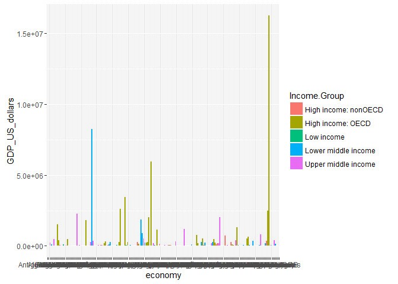
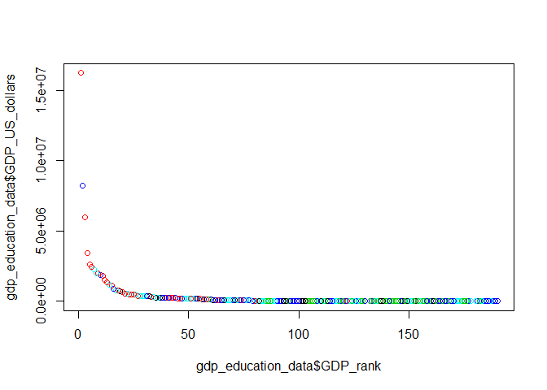
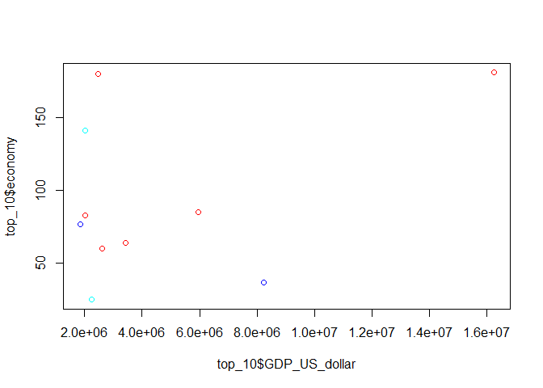
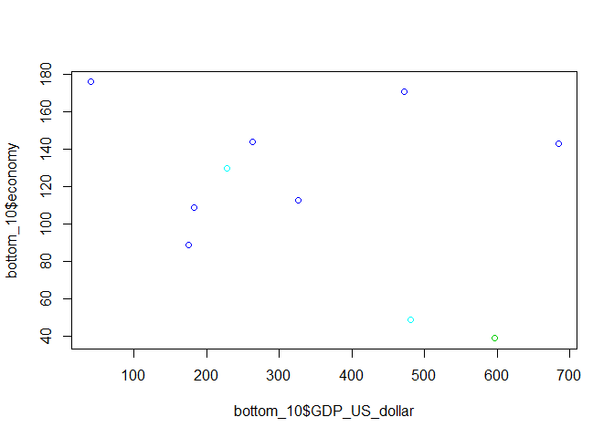

# Unit 6: Mid-term: Analysis of GDP and educational data
Alex Deshowitz  
June 11, 2016  

# Introduction
###For this study, our goal was to compare income levels with GDP levels to see what common trends exist in the data
###To perform the analysis, we took 2 datasets, one containing GDP by country code and the other containing educational/income information by countrycode, and combined the datasets.  We then used various visuals and functions to derive insights
### We have included the code to clean the data so that the results are 100% reproducible

# Data Tidying
##### Please note that this code can be found in the analysis directory for this project as data_cleanup.r
#####If you are not interested in the cleaning, please skip to the analysis section below

* The first thing to do is ensure that the user has all packages loaded

```r
library(plyr)
library(RCurl)
```

```
## Loading required package: bitops
```

* If you are not running this code from the locally cloned repo and using the r-project file, please ensure that the working directory is set to the root directory for this project in the location where you have saved this file using the setwd() function


* Now, we will download the data by first setting the variables for the URL addresses


```r
gdp_url<- "https://d396qusza40orc.cloudfront.net/getdata%2Fdata%2FGDP.csv"
educational_url<-"https://d396qusza40orc.cloudfront.net/getdata%2Fdata%2FEDSTATS_Country.csv"
```

* Next, We use the download.file() function to download the files into the analysis/data directory


```r
download.file(gdp_url, "analysis/data/getdata-data-gdp.csv")
download.file(educational_url, "analysis/data/getdata-data-EDSTATS_Country.csv")
```

* The data are now stored locally in .csv format in the data folder in the project, we need to load these into the R-environment.  We will first work with the gdp data and load the educational data after gdp is tidy.  Notice in the code, we are skipping blank lines and the first 3 lines because our initial load showed those as blank


```r
raw_gdp<- read.csv("analysis/data/getdata-data-gdp.csv",header = TRUE, skip = 3, blank.lines.skip = TRUE) 
```

* After running print(raw_gdp) [not doing it here for the sake of the MD file], we see that the data essentially stops at record 232.   The only thing below that is the commentary, which we do not need, we will reread the data in without those rows


```r
raw_gdp<- read.csv("analysis/data/getdata-data-gdp.csv",header = TRUE, skip = 3, blank.lines.skip = TRUE, nrows = 232) 
```

* Now, running print() shows we are at a good starting point
* I would like to change the column names, because these look pretty bad.  I am going to rename the columns in the dataset.


```r
colnames(raw_gdp)
```

```
##  [1] "X"           "Ranking"     "X.1"         "Economy"     "US.dollars."
##  [6] "X.2"         "X.3"         "X.4"         "X.5"         "X.6"
```

```r
names(raw_gdp) <-c("country_code","GDP_rank", "null_col","economy","GDP_US_dollars","letter_column" )

colnames(raw_gdp)
```

```
##  [1] "country_code"   "GDP_rank"       "null_col"       "economy"       
##  [5] "GDP_US_dollars" "letter_column"  NA               NA              
##  [9] NA               NA
```
* Alright, we have good names, but I do have that one weird blank column and several NA columns to the right of my main data that probably stored overflow text in the initial download.  I will get rid of those


```r
keepers<- c("country_code","GDP_rank","economy","GDP_US_dollars","letter_column" )

raw_gdp<- raw_gdp[,keepers]

colnames(raw_gdp)
```

```
## [1] "country_code"   "GDP_rank"       "economy"        "GDP_US_dollars"
## [5] "letter_column"
```
* The column names and column wise information look good now, we can also print() or head() the data, but I will not do that to save space in the .md file- we did do this in the analysis to ensure everything looked alright

* Let's see which rows have NA values.  The sapply of is.na works well for this task.

```r
sapply(raw_gdp, function(x) length(which(is.na(x))))
```

```
##   country_code       GDP_rank        economy GDP_US_dollars  letter_column 
##              0             42              0              0              0
```
* It looks like the GDP rank column has some NAs on further inspection, all of these records look like aggregations of some country groups.  For the sake of this analysis, those are not necessary and they are removed

```r
raw_gdp<- na.omit(raw_gdp)

sapply(raw_gdp, function(x) length(which(is.na(x))))
```

```
##   country_code       GDP_rank        economy GDP_US_dollars  letter_column 
##              0              0              0              0              0
```
* The NAs are now removed from the dataset and there are 190 countries remaining

* One of the most important steps in analysis is assuring that the variables are of the correct class.  Otherwise, functions will not work as expected.  The code below checks for the class of the variables.


```r
sapply(raw_gdp, class)
```

```
##   country_code       GDP_rank        economy GDP_US_dollars  letter_column 
##       "factor"      "integer"       "factor"       "factor"       "factor"
```
* It appears that "GDP_US_dollars"" is a factor, I would like this to be numeric, but I noticed (after many trials) that commas are present in the factor.  Therefore, the code below removes commas and changes the variable class to numeric


```r
raw_gdp$GDP_US_dollars<- as.numeric(gsub(",","",raw_gdp$GDP_US_dollars))

# check the results

sapply(raw_gdp, class)
```

```
##   country_code       GDP_rank        economy GDP_US_dollars  letter_column 
##       "factor"      "integer"       "factor"      "numeric"       "factor"
```

* The data looks pretty good now, at this point, if you would like to see the data, you can run summary(), view(), or str() on the data to check it out.  The markdown will not include the results of this code for the sake of space and redundancy.

* Now, moving onto the raw educational data.  The code below reads in the file


```r
raw_educ<- read.csv("analysis/data/getdata-data-EDSTATS_Country.csv",header = TRUE)
```

* The code below looks for NAs in the newly imported dataset rew_educ


```r
sapply(raw_educ, function(x) length(which(is.na(x))))
```

```
##                                       CountryCode 
##                                                 0 
##                                         Long.Name 
##                                                 0 
##                                      Income.Group 
##                                                 0 
##                                            Region 
##                                                 0 
##                                  Lending.category 
##                                                 0 
##                                      Other.groups 
##                                                 0 
##                                     Currency.Unit 
##                                                 0 
##                          Latest.population.census 
##                                                 0 
##                           Latest.household.survey 
##                                                 0 
##                                     Special.Notes 
##                                                 0 
##                       National.accounts.base.year 
##                                                 0 
##                  National.accounts.reference.year 
##                                               197 
##                       System.of.National.Accounts 
##                                               149 
##                               SNA.price.valuation 
##                                                 0 
##                     Alternative.conversion.factor 
##                                                 0 
##                                   PPP.survey.year 
##                                                89 
##                 Balance.of.Payments.Manual.in.use 
##                                                 0 
##                    External.debt.Reporting.status 
##                                                 0 
##                                   System.of.trade 
##                                                 0 
##                     Government.Accounting.concept 
##                                                 0 
##                   IMF.data.dissemination.standard 
##                                                 0 
## Source.of.most.recent.Income.and.expenditure.data 
##                                                 0 
##                       Vital.registration.complete 
##                                                 0 
##                        Latest.agricultural.census 
##                                                 0 
##                            Latest.industrial.data 
##                                               139 
##                                 Latest.trade.data 
##                                                46 
##                      Latest.water.withdrawal.data 
##                                                82 
##                                     X2.alpha.code 
##                                                 1 
##                                         WB.2.code 
##                                                 1 
##                                        Table.Name 
##                                                 0 
##                                        Short.Name 
##                                                 0
```

* It looks like alot of observations contain NAs; however, I may not want to do the same filtering in this dataset.  When filtering tables that add dimensionality to the dataset, rows do not necessarily need to contain complete records due to analytical relevance to the question at hand.  Therefore, abscence of one variable does not negate the entire record when adding dimensionality rather than measurability to a dataset.  Additionally, this analysis is not concerned with the null variables.

* Check this data hypothesis using head() and str() if necessary

* Since the datasets are being merged, the column names need to be the same.  The join field in this case is "country code."  The analysis preference in this case is score based word separation rather than camelback.


```r
colnames(raw_educ)
```

```
##  [1] "CountryCode"                                      
##  [2] "Long.Name"                                        
##  [3] "Income.Group"                                     
##  [4] "Region"                                           
##  [5] "Lending.category"                                 
##  [6] "Other.groups"                                     
##  [7] "Currency.Unit"                                    
##  [8] "Latest.population.census"                         
##  [9] "Latest.household.survey"                          
## [10] "Special.Notes"                                    
## [11] "National.accounts.base.year"                      
## [12] "National.accounts.reference.year"                 
## [13] "System.of.National.Accounts"                      
## [14] "SNA.price.valuation"                              
## [15] "Alternative.conversion.factor"                    
## [16] "PPP.survey.year"                                  
## [17] "Balance.of.Payments.Manual.in.use"                
## [18] "External.debt.Reporting.status"                   
## [19] "System.of.trade"                                  
## [20] "Government.Accounting.concept"                    
## [21] "IMF.data.dissemination.standard"                  
## [22] "Source.of.most.recent.Income.and.expenditure.data"
## [23] "Vital.registration.complete"                      
## [24] "Latest.agricultural.census"                       
## [25] "Latest.industrial.data"                           
## [26] "Latest.trade.data"                                
## [27] "Latest.water.withdrawal.data"                     
## [28] "X2.alpha.code"                                    
## [29] "WB.2.code"                                        
## [30] "Table.Name"                                       
## [31] "Short.Name"
```

```r
colnames(raw_educ)[1]<- "country_code"

colnames(raw_educ)
```

```
##  [1] "country_code"                                     
##  [2] "Long.Name"                                        
##  [3] "Income.Group"                                     
##  [4] "Region"                                           
##  [5] "Lending.category"                                 
##  [6] "Other.groups"                                     
##  [7] "Currency.Unit"                                    
##  [8] "Latest.population.census"                         
##  [9] "Latest.household.survey"                          
## [10] "Special.Notes"                                    
## [11] "National.accounts.base.year"                      
## [12] "National.accounts.reference.year"                 
## [13] "System.of.National.Accounts"                      
## [14] "SNA.price.valuation"                              
## [15] "Alternative.conversion.factor"                    
## [16] "PPP.survey.year"                                  
## [17] "Balance.of.Payments.Manual.in.use"                
## [18] "External.debt.Reporting.status"                   
## [19] "System.of.trade"                                  
## [20] "Government.Accounting.concept"                    
## [21] "IMF.data.dissemination.standard"                  
## [22] "Source.of.most.recent.Income.and.expenditure.data"
## [23] "Vital.registration.complete"                      
## [24] "Latest.agricultural.census"                       
## [25] "Latest.industrial.data"                           
## [26] "Latest.trade.data"                                
## [27] "Latest.water.withdrawal.data"                     
## [28] "X2.alpha.code"                                    
## [29] "WB.2.code"                                        
## [30] "Table.Name"                                       
## [31] "Short.Name"
```

* The field is now changed for joining

* Now, the data needs to be joined, and the code will check the class just to make sure that nothing changed. (this can happen).  PLEASE NOTE: The argument for all is set equal to FALSE.  An inner join is the only type of join that truly makes sense in this case, since I will be using at least one variable from the education table for every variable in the GDP table


```r
clean_gdp_education_data<- merge(x = raw_gdp, y = raw_educ, by = "country_code", all = FALSE)

sapply(clean_gdp_education_data, class)
```

```
##                                      country_code 
##                                          "factor" 
##                                          GDP_rank 
##                                         "integer" 
##                                           economy 
##                                          "factor" 
##                                    GDP_US_dollars 
##                                         "numeric" 
##                                     letter_column 
##                                          "factor" 
##                                         Long.Name 
##                                          "factor" 
##                                      Income.Group 
##                                          "factor" 
##                                            Region 
##                                          "factor" 
##                                  Lending.category 
##                                          "factor" 
##                                      Other.groups 
##                                          "factor" 
##                                     Currency.Unit 
##                                          "factor" 
##                          Latest.population.census 
##                                          "factor" 
##                           Latest.household.survey 
##                                          "factor" 
##                                     Special.Notes 
##                                          "factor" 
##                       National.accounts.base.year 
##                                          "factor" 
##                  National.accounts.reference.year 
##                                         "integer" 
##                       System.of.National.Accounts 
##                                         "integer" 
##                               SNA.price.valuation 
##                                          "factor" 
##                     Alternative.conversion.factor 
##                                          "factor" 
##                                   PPP.survey.year 
##                                         "integer" 
##                 Balance.of.Payments.Manual.in.use 
##                                          "factor" 
##                    External.debt.Reporting.status 
##                                          "factor" 
##                                   System.of.trade 
##                                          "factor" 
##                     Government.Accounting.concept 
##                                          "factor" 
##                   IMF.data.dissemination.standard 
##                                          "factor" 
## Source.of.most.recent.Income.and.expenditure.data 
##                                          "factor" 
##                       Vital.registration.complete 
##                                          "factor" 
##                        Latest.agricultural.census 
##                                          "factor" 
##                            Latest.industrial.data 
##                                         "integer" 
##                                 Latest.trade.data 
##                                         "integer" 
##                      Latest.water.withdrawal.data 
##                                         "integer" 
##                                     X2.alpha.code 
##                                          "factor" 
##                                         WB.2.code 
##                                          "factor" 
##                                        Table.Name 
##                                          "factor" 
##                                        Short.Name 
##                                          "factor"
```

* For the final step, a tidy dataset is created to be used in the remainder of the analysis.  Notice, to keep the data tidy, row names are not present.


```r
write.csv(clean_gdp_education_data,"analysis/data/tidy_gdp_educ_data.csv", row.names = FALSE)
```


# Data Analysis
##### Please note that this code can be found in the analysis directory for this project as data_analysis.r

* The data_cleanup.R file contains all of the tidying procedures used to get to the analysis phase.
* To run the code and re-create the file you must can call the source() function.

* The only additional package used in this analysis is: ggplot2


```r
library(ggplot2)
```

* In case, the previous code was not run in the tidying section, you need to make sure that you have a tidy file.  The source code will ensure that this occurs.  The results of source will be hidden in the MD file to keep the MD file manageable


```r
source("analysis/data_cleanup.R")
```

* To start fresh, clear the workspace


```r
ls()
```

```
## [1] "clean_gdp_education_data" "educational_url"         
## [3] "gdp_url"                  "keepers"                 
## [5] "raw_educ"                 "raw_gdp"
```

```r
rm(list= ls())
ls()
```

```
## character(0)
```

* Now read in the tidy dataset for the analysis


```r
gdp_education_data<- read.csv("analysis/data/tidy_gdp_educ_data.csv", header = TRUE)
```

* Please note that the column formats are indeed intentional.  This ensures that we can identify which columns came from which original file - this is a pretty nifty trick that many (rogue) DBAs perform.

### Analysis Questions

**question1: How many of the IDs match?**


```r
matching_cases<- nrow(gdp_education_data)
matching_cases
```

```
## [1] 189
```

* There are 189 matching cases in this dataset.  In this case due to the merge property of all=FALSE, the inner join allows a simple record count to answer the question

**Question2: What is the 13th country in the dataframe when the data is sorted in ascending order by GDP dollars?**


```r
# first, I will order the data:

gdp_education_data<- gdp_education_data[order(gdp_education_data$GDP_US_dollars),]

# second, I will pull the 13th country, and make it into a variable because I like creating variables

thirteenth_ranked_country <- gdp_education_data[13,]

# I filtered for rank 13, but it is still a dataframe, I want a clean result, so I will just make the variable a vector
class(thirteenth_ranked_country)
```

```
## [1] "data.frame"
```

```r
as.vector(thirteenth_ranked_country$economy)
```

```
## [1] "St. Kitts and Nevis"
```

```r
# Alright, St. Kitts and Nevis is the 13th smallest
```

* St. Kitts and Nevis is the 13th smallest economy in the joined dataset


**Question3: What are the average GDP rankings for the "high income:oecd and "high income nonOECD" groups?**


```r
# first let me filter out the dataset
high_income_groups<- subset(gdp_education_data,Income.Group == "High income: OECD" | Income.Group == "High income: nonOECD")

#This seems right, but let me make sure that I am only pulling those 2 groups
as.vector(unique(high_income_groups$Income.Group))
```

```
## [1] "High income: nonOECD" "High income: OECD"
```

```r
length(as.vector(unique(high_income_groups$Income.Group)))
```

```
## [1] 2
```

```r
# great, that looks good

aggregate(high_income_groups$GDP_rank, list(high_income_groups$Income.Group),FUN = mean)
```

```
##                Group.1        x
## 1 High income: nonOECD 91.91304
## 2    High income: OECD 32.96667
```

```r
# looks like the mean rank of High income: nonOECD  is 91.9 and the mean rank of the high income: OECD is about 33.0 (32.9 rounded)
```

* The mean rank of the High income: nonOECD group is 91.9, while the mean rank of the High income: OECD group is 33.0

**Question4: Plot the gdp of all countries.  Use ggplot2 to color your plot by income group**


```r
ggplot(data = gdp_education_data, aes(x = economy, y = GDP_US_dollars, fill = Income.Group )) + geom_bar(stat = "identity")
```

<!-- -->

* It is easy to see that the U.S. has nearly twice the GDP of its next largest peer, China, in the year 2012.

* This plot was a little bit more readable for me, but same takeaway

```r
plot(gdp_education_data$GDP_rank, gdp_education_data$GDP_US_dollars, col = gdp_education_data$Income.Group)
```

<!-- -->

**Question5: Cut the GDP ranking into 5 separate quantile groups, make a table versus income group. How many countries are Lower middle income but among the 38 nations with highest GDP?**

* To answer this question, multiple steps make the process seem easier.  First, we can use the sequence function learned in SWIRL to get the 5 quantiles (since each quantile is 20%, we partition by .2.


```r
seq(0,1,.2)
```

```
## [1] 0.0 0.2 0.4 0.6 0.8 1.0
```

* Then place the variable into the dataset using the cut function and print the table made with the aggregate function


```r
gdp_education_data$GDP_quantile<- cut(gdp_education_data$GDP_rank, quantile(gdp_education_data$GDP_rank, probs = c(0.0, 0.2, 0.4, 0.6, 0.8, 1.0)))

quantile_table<-aggregate(gdp_education_data$GDP_rank, list(gdp_education_data$Income.Group, gdp_education_data$GDP_quantile),FUN = length)
quantile_table
```

```
##                 Group.1     Group.2  x
## 1  High income: nonOECD    (1,38.6]  4
## 2     High income: OECD    (1,38.6] 17
## 3   Lower middle income    (1,38.6]  5
## 4   Upper middle income    (1,38.6] 11
## 5  High income: nonOECD (38.6,76.2]  5
## 6     High income: OECD (38.6,76.2] 10
## 7            Low income (38.6,76.2]  1
## 8   Lower middle income (38.6,76.2] 13
## 9   Upper middle income (38.6,76.2]  9
## 10 High income: nonOECD  (76.2,114]  8
## 11    High income: OECD  (76.2,114]  1
## 12           Low income  (76.2,114]  9
## 13  Lower middle income  (76.2,114] 11
## 14  Upper middle income  (76.2,114]  8
## 15 High income: nonOECD   (114,152]  4
## 16    High income: OECD   (114,152]  1
## 17           Low income   (114,152] 16
## 18  Lower middle income   (114,152]  9
## 19  Upper middle income   (114,152]  8
## 20 High income: nonOECD   (152,190]  2
## 21           Low income   (152,190] 11
## 22  Lower middle income   (152,190] 16
## 23  Upper middle income   (152,190]  9
```

* To answer how many countries are lower-middle income, but among the nations with the highest GDP, simply subset the dataframe and count the number of rows present in the dataset


```r
nrow(highest_GDP_lowest_income_data<- subset(gdp_education_data,Income.Group == "Lower middle income" & GDP_rank <39))
```

```
## [1] 5
```

* There are a total of 5 nations that are Lower middle income but among the nations within the 38th highest GDP

* Just to try to break the data out a little bit more, I am a little interested in the top and bottom 10


```r
top_10<- subset(gdp_education_data,GDP_rank <11)
plot(top_10$GDP_US_dollar,top_10$economy,  col = top_10$Income.Group)
```

<!-- -->

```r
bottom_10<- subset(gdp_education_data,GDP_rank >180)
plot(bottom_10$GDP_US_dollar,bottom_10$economy,  col = bottom_10$Income.Group)
```

<!-- -->

* It is intresting that in the top 10 there is no linear trend, but most of the countries are definitely high income.  The biggest exceptions in the group are China and India.  It appears that countries with high incomes tend to create large GDP values.  WE would want to bring in some population statistics into the dataset as well since that is more than likely a variable that gets China and India into the top 10.  Lots of low incomes spread over large populations versus higher incomes spread over smaller populations.  Of course, we don't need to go very far to figure out why.  China is a huge manufacturing country known for cheap labor and the low-cost replication of other countries' products .  While India is a mecca for tech outsourcing due to low prices.

* It is also very interesting that the bottom 10 GDP countries are not necessarily the lowest income.  Infact most of these countries are in the lower-middle category in leisure destinations in the Pacific

# Conclusion

Based on the data, we can see that in the year 2012, the United states still had the largest economy in the world.  The size of the economy was actually nearly twice that of the next largest peer.  Additionally, we found that just because a country has a lower income, does not necessarily mean that the country produces a very low GDP.  Upon further investigation, we did find that most of the countries in the top 10 by rank did have higher incomes.  However, countries such as China and India made it into the top 10 more than likely due to a mixture of their population sizes and the servce/manufacturing based economies of these countries.  When we looked at the bottom 10 countries, the hypothesis was that these countries would fall into the "low income" category.  However, we found that most of the countries were geographically located in the Pacific region and more than likely did fetch slightly higher incomes due to the destination-based economies.  Of course, we would need more information to confirm these hypotheses.  Overall, we can say that high GDP does not necessarily indicate that incomes in those countries are higher.  Of course, this data is strictly observational, so all of these inferences are observational and not causal in nature.

# R session details


```r
sessionInfo()
```

```
## R version 3.3.0 (2016-05-03)
## Platform: x86_64-w64-mingw32/x64 (64-bit)
## Running under: Windows 10 x64 (build 10586)
## 
## locale:
## [1] LC_COLLATE=English_United States.1252 
## [2] LC_CTYPE=English_United States.1252   
## [3] LC_MONETARY=English_United States.1252
## [4] LC_NUMERIC=C                          
## [5] LC_TIME=English_United States.1252    
## 
## attached base packages:
## [1] stats     graphics  grDevices utils     datasets  methods   base     
## 
## other attached packages:
## [1] ggplot2_2.1.0  RCurl_1.95-4.8 bitops_1.0-6   plyr_1.8.3    
## 
## loaded via a namespace (and not attached):
##  [1] Rcpp_0.12.5      digest_0.6.9     grid_3.3.0       gtable_0.2.0    
##  [5] formatR_1.4      magrittr_1.5     scales_0.4.0     evaluate_0.9    
##  [9] stringi_1.0-1    rmarkdown_0.9.6  labeling_0.3     tools_3.3.0     
## [13] stringr_1.0.0    munsell_0.4.3    yaml_2.1.13      colorspace_1.2-6
## [17] htmltools_0.3.5  knitr_1.13
```

